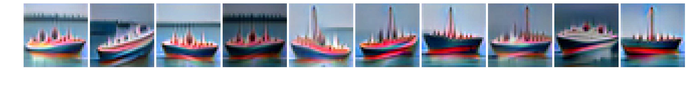

# Asymmetrical Adversarial Training on CIFAR10

## Base detector training
First download and extract model checkpoints. This will put the pretrained classifier in a designated location.

Use train.py to train base detectors. For example, the following command trains the k=0 eps=8.0 model.
```
$ python train.py --target_class 0 --epsilon 8.0 --norm Linf --num_steps 40 --step_size 0.5
```

## Evaluation
First download and extract model checkpoints.

**Robustness test.** Use eval_base_detector.py to evaluate base detectors. As an example, the following tests the first eps8.0 base detector.
```
$ python eval_base_detector.py --epsilon 8.0 --norm Linf --steps 10 --step_size 2.0  --target_class 0 --prefixed \
models/cifar10_ovr_Linf_8.0_iter40_lr0.5_bs300/class0_ckpt_best/checkpoint-27000
```
    
**Detection performance.** Use eval_detection.py to test the detection performances of integrated detection and generated detection.

**Robust classification performance.** Use eval_generative_classifier.py and eval_integrated_classifier.py to test the classification performances of generative classification and integrated classification.

**Minimum mean L2 distance.** Use min_L2_perturb.py to reproduce the minimum mean L2 distance results.

**Synthesize images.**
```
$ # Generate ship images by attacking the class 8 base detector
$ python synthesis.py --target_class 8 --prefixed \
models/cifar10_ovr_Linf_8.0_iter40_lr0.5_bs300/class8_ckpt_best/checkpoint-16000
```



## Model checkpoints
Pretrained models include naturally trained classifiers, an adversarially trained classifier, and eps8.0 base detectors.

Download the extract pretrained models. This will create a new directory "models" and pupulate it with pretrained models.
```
$ wget https://asymmetrical-adversarial-training.s3.amazonaws.com/cifar10/checkpoints.tar.gz
$ tar zxvf checkpoints.tar.gz
```
