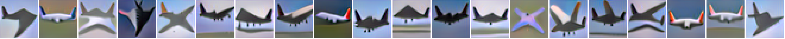
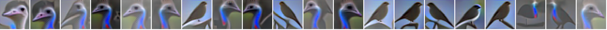
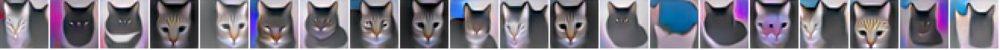
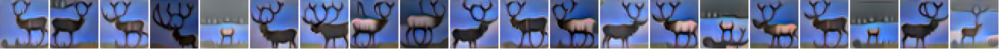
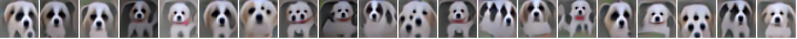
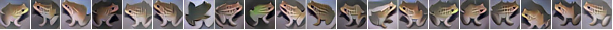
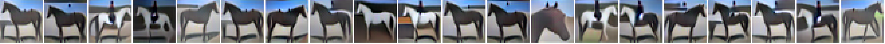

# Asymmetrical Adversarial Training on CIFAR10

## Base detector training
First download and extract model checkpoints. This will put the pretrained classifier in a designated location.

Use train.py to train base detectors. For example, the following command trains the k=0 eps=8.0 model.
```
$ python train.py --target_class 0 --epsilon 8.0 --norm Linf --num_steps 40 --step_size 0.5
```

## Evaluation
First download and extract model checkpoints.

**Robustness test.** Use eval_base_detector.py to evaluate base detectors. As an example, the following tests the first eps8.0 base detector.
```
$ python eval_base_detector.py --epsilon 8.0 --norm Linf --steps 10 --step_size 2.0  --target_class 0 \
--prefixed models/cifar10_ovr_Linf_8.0_iter40_lr0.5_bs300/class0_ckpt_best/checkpoint-27000
```

**Robustness test &mdash; Nattack based Black-box test**
```
$ python eval_base_detector_Nattack.py --target_class 0 --prefixed \
models/cifar10_ovr_Linf_8.0_iter40_lr0.5_bs300/class0_ckpt_best/checkpoint-27000
```
    
**Detection performance.** Use eval_detection.py to test the detection performances of integrated detection and generated detection.

**Robust classification performance.** Use eval_generative_classifier.py and eval_integrated_classifier.py to test the classification performances of generative classification and integrated classification.

**Minimum mean L2 distance.** Use min_L2_perturb.py to reproduce the minimum mean L2 distance results.

**Synthesize images.**
```
$ # Generate ship images by attacking the class 8 base detector
$ python synthesis.py --target_class 8 --prefixed \
models/cifar10_ovr_Linf_8.0_iter40_lr0.5_bs300/class8_ckpt_best/checkpoint-16000
```

<p align="center"> </p>

Images generated with eps16.0 constrained models
```
$ # Generate ship images by attacking the class 8 base detector (eps16.0 model)
$ python synthesis.py --epsilon 25500 --num_steps 200 --target_class 8 --prefixed \
models/cifar10_ovr_Linf_16.0_iter80_lr0.5_bs300/class8/checkpoint-10000
```

<p align="center"></p>
<p align="center"></p>
<p align="center"></p>
<p align="center"></p>
<p align="center"></p>
<p align="center"></p>
<p align="center"></p>
<p align="center"></p>
<p align="center"></p>
<p align="center"></p>

### Gaussian noise attack (i.e., rubbish examples)
Image generated by attacking the generative classifier and discriminative robust classifier using (the same) Gaussian noise image. Image titles are the logit outputs of corresponding models. We used unconstrained L2 based PGD attack of step-size 0.5\*255. The five columns corresponding to the perturbed images at step 0, 50, 100, 150, and 200.
<p align="center"></p>

## Model checkpoints
Pretrained models include naturally trained classifiers, an adversarially trained classifier, and eps8.0 base detectors.

Download the extract pretrained models. This will create a new directory "models" and populate it with pretrained models.
```
$ wget https://asymmetrical-adversarial-training.s3.amazonaws.com/cifar10/checkpoints.tar.gz
$ tar zxvf checkpoints.tar.gz
$ # eps16 constrained detectors
$ wget https://asymmetrical-adversarial-training.s3.amazonaws.com/cifar10/checkpoints_eps16.tar.gz
```
